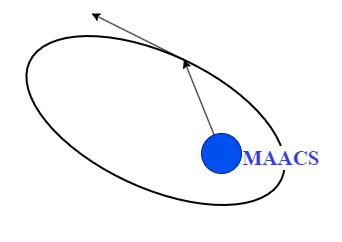

# Orbital Mechanics and Attitude Simulator (OMAACS)

This Projects primary function is to design a basic simulator to experiment with orbital mechanics and attitude control systems, primarily for satellites in orbit around earth.

## Setup

We recommend using WSL-Ubuntu-20.04 for developement. Installing WSL and distro will not be covered in this tutorial.

----

### Cloning

Navigate to the basic directory

```
git clone https://github.com/euraposis/OMAACS.git
```

### Building

We use clang and make installation under ubuntu is straight forward